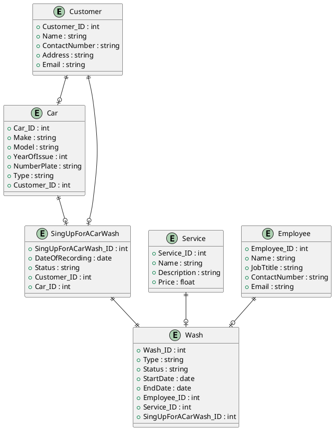

### Esatimates (Примерные показатели)

Регион: Сахалинская область  
Численность региона: 500К человек  
DAU: 15% от 500К = 75К  
RPS: 75K / 24 / 3600 ~= 1  


## User Story

1. Я как клиент автомойки, хочу выбрать тип мойки автомобиля (ручная, автоматическая, экспресс), чтобы обслуживать свою машину в соответствии с предпочтениями и временем.
2. Я как клиент автомойки, хочу записаться на мойку через мобильное приложение или сайт, чтобы выбрать удобное время и избежать очереди.
3. Я как клиент автомойки, хочу получить уведомление о готовности автомобиля после мойки, чтобы точно знать, когда можно забрать машину.
4. Я как клиент автомойки, хочу иметь возможность оплатить услуги онлайн через приложение или сайт, чтобы избежать очередей и не тратить время на оплату на месте.
5. Я как клиент автомойки, хочу получать скидки или бонусы за постоянное использование услуг, чтобы экономить на дальнейших визитах.
6. Я как клиент автомойки, хочу видеть отзывы других клиентов о качестве работы, чтобы быть уверенным в высоком уровне обслуживания.
7. Я как клиент автомойки, хочу, чтобы мой автомобиль был помыт в течение оговоренного времени, чтобы не тратить лишнее время.
8. Я как клиент автомойки, хочу видеть фотографии или видео процесса мойки и ухода за моим автомобилем, чтобы убедиться в высоком качестве услуг и уровне обслуживания.
9. Я как клиент автомойки, хочу, чтобы персонал автомойки предложил рекомендации по уходу за кузовом или салоном машины, чтобы поддерживать её в хорошем состоянии.
10. Я как клиент автомойки, хочу, чтобы на автомойке была зона отдыха с кофе или напитками, чтобы я мог комфортно подождать, пока мой автомобиль моется.


## Use Cases  


<details>
  <summary>Код для Use Cases (PlantTextUML)</summary>
  
```plantuml
left to right direction
actor "Клиент" as client
rectangle "Платёжная штука" as plata
rectangle ВсеМойки.ру {
usecase "UC1: Управление своим профилем" as UC1
usecase "UC2: Управление своим авто" as UC2
usecase "UC3: Запись на мойку" as UC3
usecase "UC3.1: Выбрать город" as UC31
usecase "UC3.1.1: Выбрать мойку" as UC311
usecase "UC3.2: Выбрать услугу" as UC32
usecase "UC3.3: Дата время" as UC33
usecase "UC3.4: Отменить запись" as UC34
usecase "UC4: Оплата услуги" as UC4
usecase "UC4.1: Способ оплаты" as UC41
}

client --> UC1
client --> UC2
client --> UC3
UC3 ..> UC31:(include)
UC31 ..> UC311:(include)
UC3 ..> UC32:(include)
UC3 ..> UC33:(include)
UC3 ..> UC34:(include)
client --> UC4
UC4 ..> UC41:(include)
UC41 --> plata

@enduml
```
</details>

### Сценарии использования:  
- UC_01: Найти и выбрать автомойку
  - Участники:
    - Пользователь приложения
  - Предусловия:
    - Пользователь зарегестрирован и авторизован
  - Условие для запуска сценария:
    - Пользователь нажимает кнопку "Найти мойку" 
  - Признак успешности:
    - Пользователь выбрал автомойку 

#### Базовый сценарий

1. Система проверяет, что клиент передал свою геолокацию
   ЕСЛИ: Геолокации нет,
   ТО: Система переходит в "Базовый сценарий 3"
3. Система ищет ближайшие к позиции клиента мойки | АЛ_01: Алгоритм поиска моек по адресу или геолокации
4. Система формирует список моек
5. Система отображает экран с картой и списком моек | UI_01
6. Система ожидает выбора мойки клиентом
7. Система переходит к экрану выбора услуг
8. Сценарий завершен

UI_01: Экран с картой и списком моек

#### Базовый сценарий 2

1. Система выводит сообщение клиента с просьбой разрешить передачу геолокации
2. ЕСЛИ: клиент разрешил передачу геолокации   
   ТО: Система переходит в "Базовый сценарий шаг 2"   
   ИНАЧЕ: Перейти в "Базовый сценарий 3"

#### Базовый сценарий 3

1. Система отображает поле для ввода адреса
2. Система ожидает от клиента ввод адреса
3. Система переходит в "Базовый сценарий шаг 2" 

АЛ_01: Алгоритм поиска моек по адресу или геолокации
1. Система формирует запрос к БД
2. ...
3. ...
4. Возвращает список моек

### Альтернативный сценарий 
АС_1: Некорректный запрос пользователя


### ER-диаграмма


<details>
  <summary>Код для ERD-diagram (PlantTextUML)</summary>
  


</details>

## C4 model

#### C1 - System Context


#### C2 - Containers


## Sequense Diagram


```
@startuml
' Участники
actor "Клиент" as Client
participant "CarWashSystem" as System
participant "Service" as Service
participant "Order" as Order
database "DataBase" as DB
participant "PaySystem" as PaySystem
participant "Платёжная штука" as Pay

Client -> System: Запрос на выбор автомойки
System -> DB: Запрос на выбор автомойки
DB --> System: Список автомоек
System -> System: Сортировка списка автомоек
System -> Client: Список автомоек

Client -> Service: Запрос на выбор услуги
Service -> Service: Сортировка списка услуг
Service --> Client: Список услуг

Client -> Order: Запрос на выбор даты и времени
Order --> Client: Подтверждение даты и времени

Client -> Order: Запрос на подтверждение записи
Order -> DB: Запрос на добавление записи в БД
DB --> Order: Подтверждение добавления
Order --> Client: Запись подтверждена

Client -> PaySystem: Запрос на оплату заказа
PaySystem -> DB: Запрос на получение списка заказов
DB --> PaySystem: Список заказов
PaySystem --> Client: Способ оплаты
Client -> PaySystem: Выбор способа оплаты
PaySystem -> Pay: Запрос на оплату заказа
Pay --> Client: Подтверждение оплаты
Client -> Pay: Оплата заказа

Pay --> PaySystem: Оплата прошла
PaySystem -> Order: Изменение статуса заказа
Order -> DB: Запрос на изменение статуса заказа
DB --> Order: Изменение статуса заказа
Order --> PaySystem: Статус заказа изменён
PaySystem --> Client: Заказ оплачен

@enduml
```


