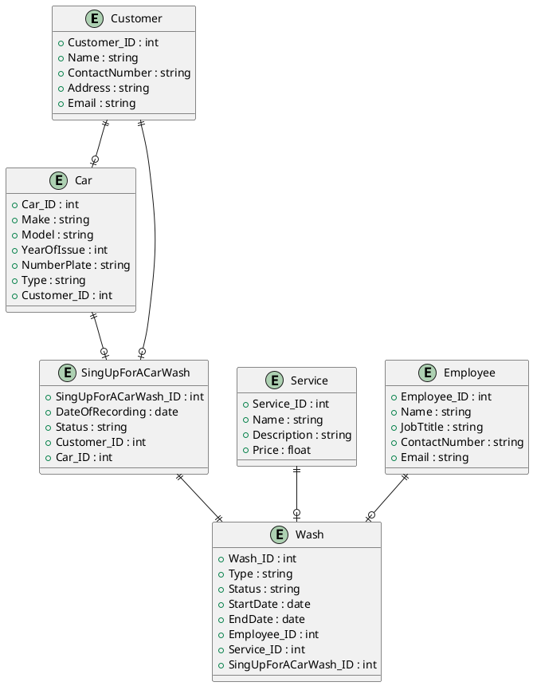

### Esatimates (Примерные показатели)

Регион: Сахалинская область  
Численность региона: 500К человек  
DAU: 15% от 500К = 75К  
RPS: 75K / 24 / 3600 ~= 1  


## User Story

1. Я как клиент автомойки, хочу выбрать тип мойки автомобиля (ручная, автоматическая, экспресс), чтобы обслуживать свою машину в соответствии с предпочтениями и временем.
2. Я как клиент автомойки, хочу записаться на мойку через мобильное приложение или сайт, чтобы выбрать удобное время и избежать очереди.
3. Я как клиент автомойки, хочу получить уведомление о готовности автомобиля после мойки, чтобы точно знать, когда можно забрать машину.
4. Я как клиент автомойки, хочу иметь возможность оплатить услуги онлайн через приложение или сайт, чтобы избежать очередей и не тратить время на оплату на месте.
5. Я как клиент автомойки, хочу получать скидки или бонусы за постоянное использование услуг, чтобы экономить на дальнейших визитах.
6. Я как клиент автомойки, хочу видеть отзывы других клиентов о качестве работы, чтобы быть уверенным в высоком уровне обслуживания.
7. Я как клиент автомойки, хочу, чтобы мой автомобиль был помыт в течение оговоренного времени, чтобы не тратить лишнее время.
8. Я как клиент автомойки, хочу видеть фотографии или видео процесса мойки и ухода за моим автомобилем, чтобы убедиться в высоком качестве услуг и уровне обслуживания.
9. Я как клиент автомойки, хочу, чтобы персонал автомойки предложил рекомендации по уходу за кузовом или салоном машины, чтобы поддерживать её в хорошем состоянии.
10. Я как клиент автомойки, хочу, чтобы на автомойке была зона отдыха с кофе или напитками, чтобы я мог комфортно подождать, пока мой автомобиль моется.


## Use Cases  


<details>
  <summary>Код для Use Cases (PlantTextUML)</summary>
  
```plantuml
left to right direction
actor "Клиент" as client
rectangle "Платёжная штука" as plata
rectangle ВсеМойки.ру {
usecase "UC1: Управление своим профилем" as UC1
usecase "UC2: Управление своим авто" as UC2
usecase "UC3: Запись на мойку" as UC3
usecase "UC3.1: Выбрать город" as UC31
usecase "UC3.1.1: Выбрать мойку" as UC311
usecase "UC3.2: Выбрать услугу" as UC32
usecase "UC3.3: Дата время" as UC33
usecase "UC3.4: Отменить запись" as UC34
usecase "UC4: Оплата услуги" as UC4
usecase "UC4.1: Способ оплаты" as UC41
}

client --> UC1
client --> UC2
client --> UC3
UC3 ..> UC31:(include)
UC31 ..> UC311:(include)
UC3 ..> UC32:(include)
UC3 ..> UC33:(include)
UC3 ..> UC34:(include)
client --> UC4
UC4 ..> UC41:(include)
UC41 --> plata

@enduml
```
</details>

## Сценарии использования:  
### UC1: Управление своим профилем
- Участники: Клиент
- Предусловия: Пользователь зарегистрирован и авторизован
- Условие для запуска сценария: Пользователь переходит в раздел "Управление профилем"
- Признак успешности: Пользователь просмотрел информацию в профиле и смог внести изменения 

### Базовый сценарий:
1. Система отображает информацию профиля пользователя 
2. Клиент выбирает опцию редактирования
3. Клиент вносит изменения в нужные поля
4. Система проверяет корректность введённых данных 
	- ЕСЛИ: Данные введены некорректно,
	- ТО: Переход к "Альтернативный сценарий"
5. Система сохраняет изменения в базе данных
6. Система отображает сообщение об успешном обновлении профиля
7. Сценарий завершён

### Альтернативный сценарий:
1. Система обнаруживает ошибку в введённых данных
2. Система отображает сообщение об ошибке и просит клиента исправить данные
3. Клиент исправляет данные и пытается сохранить изменения еще раз


### UC2: Управление своим авто
- Участники: Клиент
- Предусловия: Пользователь зарегистрирован и авторизован
- Условие для запуска сценария: Пользователь переходит в раздел "Управление авто"
- Признак успешности: Пользователь просмотрел информацию в разделе и смог внести изменения 

### Базовый сценарий:
1. Система отображает список авто пользователя 
2. Пользователь может выбрать одну из следующих опций: “Добавить авто”, “Редактировать данные об авто” или “Удалить авто” 
	- Если клиент выбрал “Добавить авто”: 
		- Система отображает форму добавления авто
  		- Клиент вводит данные авто
		    - ЕСЛИ: Данные введены некорректно,
      		    - ТО: Переход к "Альтернативный сценарий"
		- Система сохраняет данные в базу
		- Система отображает сообщение об успешном добавлении авто
	- Если клиент выбрал “Редактировать автомобиль”:
 		- Система отображает форму редактирования
		- Клиент изменяет данные
		    - ЕСЛИ: Данные введены некорректно,
      		    - ТО: Переход к "Альтернативный сценарий"
		- Система сохраняет изменения
		- Система отображает сообщение об успешном обновлении данных авто
	- Если клиент выбрал “Удалить автомобиль”: 
	    - Система запрашивает подтверждение удаления
			- Если клиент подтвердил удаление, система удаляет данные об автомобиле
		- Система отображает сообщение об успешном удалении авто из списка
3. Сценарий завершён

### Альтернативный сценарий:
1. Система обнаруживает ошибку в введённых данных
2. Система отображает сообщение об ошибке и просит клиента исправить данные
3. Клиент исправляет данные и пытается сохранить изменения еще раз


### UC3: Запись на мойку
- Участники: Пользователь
- Предусловия: Пользователь зарегистрирован и авторизован
- Условие запуска: Пользователь переходит в раздел "Запись на мойку"
- Признак успешности: Пользователь успешно записался на мойку 

### Базовый сценарий:
1. Система отображает список городов (UC3.1)
   	- ЕСЛИ: Произошёл сбой в работе системы,
	- ТО: Переход к "Альтернативный сценарий"
3. Пользователь выбирает город
4. Система отображает список моек в выбранном городе (UC3.1.1)
5. Пользователь выбирает мойку
6. Система отображает список услуг (UC3.2)
7. Пользователь выбирает нужные ему услуги
8. Система отображает свободные даты и время (UC3.3)
9. Пользователь выбирает дату и время
10. Система отображает сообщение об успешной записи на мойку
11. Система сохраняет данные о записи в базу данных
12. Сценарий завершён

### Альтернативный сценарий:
1. Система отображает сообщение о сбое системы
2. Система предлагает повторить попытку записи позже


### UC3.1: Выбрать город
- Участники: Пользователь
- Предусловие: Пользователь зарегистрирован и авторизован
- Условие запуска: Пользователь перешёл в раздел "Запись на мойку"
- Признак успешности: Пользователь выбрал город
	
### Базовый сценарий:
1. Система отображает список доступных городов
	- ЕСЛИ: Нужного города в списке нет,
	- ТО: Переход к "Альтернативный сценарий"
2. Клиент выбирает интересующий его город
3. Система отображает список моек в выбранном городе
4. Сценарий завершён

### Альтернативный сценарий:
1. Система предлагает пользователю ввести город вручную 
2. Система отображает поле для ввода города


### UC3.1.1: Выбрать мойку
- Участники: Пользователь
- Предусловие: Пользователь зарегистрирован и авторизован
- Условие запуска: Пользователь перешёл в раздел "Запись на мойку" и выбрал нужный город
- Признак успешности: Пользователь выбрал мойку

### Базовый сценарий:
1. Система проверяет, что клиент передал свою геолокацию 
	- ЕСЛИ: Геолокации нет,
	- ТО: Переход к "Альтернативный сценарий 1"
2. Система ищет ближайшие к позиции пользователя мойки
3. Система отображает список моек в выбранном городе
4. Пользователь выбирает подходящую ему мойку
5. Система отображает детальную информацию о выбранной мойке
6. Система отображает список услуг в выбранной мойке
7. Сценарий завершён

### Альтернативный сценарий 1:
1. Система отображает сообщение с просьбой разрешить передачу геолокации
	- ЕСЛИ: Пользователь разрешил передачу геолокации,
	- ТО: Переход к "Базовый сценарий шаг 2"
	- ИНАЧЕ: Переход к "Альтернативный сценарий 2"

### Альтернативный сценарий 2:
1. Система отображает поле для ввода адреса 
2. Пользователь вводит конкретный адрес 

	

### UC3.2: Выбрать услугу
- Участники: Пользователь
- Предусловие: Пользователь зарегистрирован и авторизован
- Условие запуска: Пользователь перешёл в раздел "Запись на мойку" и выбрал нужные город и мойку
- Признак успешности: Пользователь выбрал необходимые услуги

### Базовый сценарий:
1. Система отображает список услуг
	- ЕСЛИ: Список услуг недоступен,
	- ТО: Переход к "Альтернативный сценарий"
2. Пользователь выбирает необходимые услуги
3. Система сохраняет выбор пользователя
4. Система отображает свободные даты для записи
5. Сценарий завершён

### Альтернативный сценарий:
1. Система отображает сообщение об ошибке загрузке списка услуг
2. Система предлагает пользователю выбрать другую мойку


### UC3.3: Выбрать дату и время
- Участники: Пользователь
- Предусловие: Пользователь зарегистрирован и авторизован
- Условие запуска: Пользователь перешёл в раздел "Запись на мойку" и выбрал нужные город, мойку и услуги
- Признак успешности: Пользователь выбрал подходящие для него дату и время для записи


### Базовый сценарий:
1. Система отображает календарь с доступными датами
	- ЕСЛИ: Расписание недоступно,
	- ТО: Переход к "Альтернативный сценарий"
2. Клиент выбирает дату
3. Система отображает доступное время для записи на выбранную дату
4. Клиент выбирает время
5. Система сохраняет выбранные дату и время
6. Сценарий завершён

### Альтернативный сценарий:
1. Система отображает сообщение об ошибке загрузки календаря 
2. Система предлагает пользователю выбрать другую дату или повторить попытку записи позже


 
### UC3.4: Отменить запись
- Участники: Пользователь
- Предусловие: Пользователь зарегистрирован и авторизован
- Условие запуска: Пользователь инициирует отмену записи
- Признак успешности: Пользователь успешно отменил запись

### Базовый сценарий:
1. Система отображает список незавершённых записей пользователя
2. Пользователь выбирает запись на мойку, которую он хочет отменить
	- ЕСЛИ: Статус записи недоступен или отменён,
	- ТО: Переход к "Альтернативный сценарий"
3. Система запрашивает подтверждение отмены
4. Пользователь подтверждает отмену
5. Система сохраняет изменения статуса записи в базе данных
6. Система отображает сообщение об успешной отмене
7. Сценарий завершен

### Альтернативный сценарий:
1. Система сообщает, что запись не может быть отменена 
2. Система предлагает пользователю обратить в тех поддержку для решения проблемы


### UC4: Оплата услуги
- Участники: Пользователь, платёжная система
- Предусловие: Пользователь зарегистрирован и авторизован
- Условие запуска: Пользователь подтверждает оплату
- Признак успешности: Пользователь успешно оплатил услуги

### Базовый сценарий: 
1. Система перенаправляет клиента на страницу оплаты платёжной системы
	- ЕСЛИ: Платёжная система недоступна,
	- ТО: Переход к "Альтернативный сценарий"
2. Пользователь выбирает способ оплаты (UC4.1)
3. Пользователь вводит данные для оплаты 
4. Платёжная система отправляет запрос на оплату
5. Пользователь подтверждает оплату
6. Платёжная система проводит оплату
7. Платёжная система отображает сообщение об успешно пройденной оплате
8. Система сохраняет изменения в статусе записи
9. Сценарий завершён.

### Альтернативный сценарий:
1. Система отображает сообщение о сбое работы в платёжной системе
2. Система предлагает пользователю повторить попытку оплаты позже или выбрать другой способ оплаты


### UC4.1: Способ оплаты
- "Участники": Пользователь, платёжная система
- Предусловие: Пользователь выбрал услуги и подтвердил запись
- Условие запуска: Пользователь переходит к выбору способа оплаты
- Признак успешности: Пользователь выбрал подходящий способ оплаты

### Базовый сценарий:
1. Система отображает доступные способы оплаты 
	- ЕСЛИ: Способы оплаты недоступны,
	- ТО: Переход к "Альтернативный сценарий"
2. Клиент выбирает подходящий способ оплаты
3. Система сохраняет выбранный способ оплаты
4. Сценарий завершён

### Альтернативный сценарий: 
1. Система отображает сообщение об ошибке загрузке способов оплаты
2. Система предлагает попробовать позже или выбрать оплату на месте (если есть такая возможность)


## ER-диаграмма


<details>
  <summary>Код для ERD-diagram (PlantTextUML)</summary>
  


</details>

### Связи:
- Клиент - Автомобиль: Один клиент может иметь несколько автомобилей. (1:M)
- Автомобиль - Запись на мойку: Один автомобиль может быть связан с несколькими записями на мойку. (1:M)
- Клиент - Запись на мойку: Один клиент может записать несколько автомобилей на мойку. (1:M)
- Услуга - Мойка: Одна услуга может быть использована в нескольких мойках. (1:M)
- Работник - Мойка: Один работник может обслуживать несколько мойок. (1:M)
- Запись на мойку - Мойка: Каждая запись на мойку связана с конкретной мойкой. (1:1)

## C4 model

### C1 - System Context


### C2 - Containers


## Sequense Diagram


```
@startuml
' Участники
actor "Клиент" as Client
participant "CarWashSystem" as System
participant "Service" as Service
participant "Order" as Order
database "DataBase" as DB
participant "PaySystem" as PaySystem
participant "Платёжная штука" as Pay

Client -> System: Запрос на выбор автомойки
System -> DB: Запрос на выбор автомойки
DB --> System: Список автомоек
System -> System: Сортировка списка автомоек
System -> Client: Список автомоек

Client -> Service: Запрос на выбор услуги
Service -> Service: Сортировка списка услуг
Service --> Client: Список услуг

Client -> Order: Запрос на выбор даты и времени
Order --> Client: Подтверждение даты и времени

Client -> Order: Запрос на подтверждение записи
Order -> DB: Запрос на добавление записи в БД
DB --> Order: Подтверждение добавления
Order --> Client: Запись подтверждена

Client -> PaySystem: Запрос на оплату заказа
PaySystem -> DB: Запрос на получение списка заказов
DB --> PaySystem: Список заказов
PaySystem --> Client: Способ оплаты
Client -> PaySystem: Выбор способа оплаты
PaySystem -> Pay: Запрос на оплату заказа
Pay --> Client: Подтверждение оплаты
Client -> Pay: Оплата заказа

Pay --> PaySystem: Оплата прошла
PaySystem -> Order: Изменение статуса заказа
Order -> DB: Запрос на изменение статуса заказа
DB --> Order: Изменение статуса заказа
Order --> PaySystem: Статус заказа изменён
PaySystem --> Client: Заказ оплачен

@enduml
```


